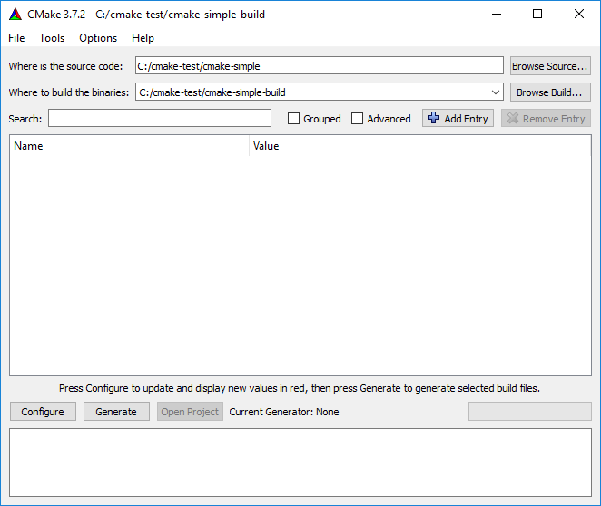
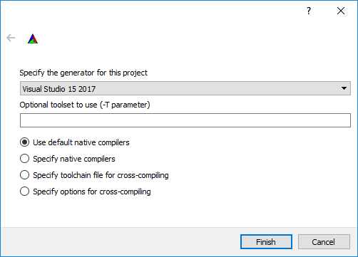
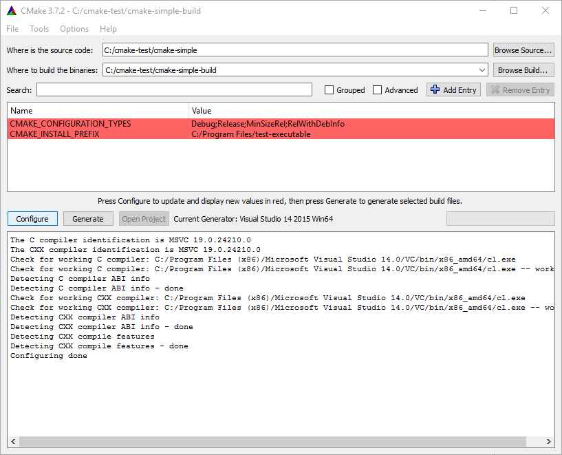
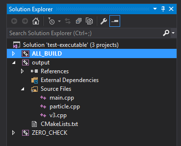
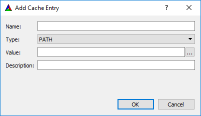

class: center, middle

# Sestavování C++ programů pomocí CMake
### Ing. Jan Görig
#### gorig@cross.cz

---

# Obsah přednášky

1. Sestavení programu v C++
2. Použití CMake pomocí GUI a příkazové řádky
3. Cmake - Definice cílů kompilace
4. Cmake - Parametrizace sestavení
5. Cmake - Kompozice projektu
6. Cmake - Toolchain
7. Cmake - Balíčky

---

# Sestavení programu v C++

.full-image[]

.small[.center[Zdroj: https://devblogs.nvidia.com/parallelforall/separate-compilation-linking-cuda-device-code/]]

---

# Sestavení programu v C++

- Přímé spuštění kompilátoru
    ```Bash
    g++ -std=c++14 v3.cpp particle.cpp main.cpp -o output.exe
    ```

- Makefile
    ```Bash
    CXX=g++
    CXXFLAGS=-std=c++14
    
    output.exe: v3.o particle.o main.o
        $(CXX) $(CXXFLAGS) v3.o particle.o main.o -o output.exe
    
    v3.o: v3.cpp
        $(CXX) $(CXXFLAGS) -c v3.cpp -o v3.o
    
    main.o: main.cpp
        $(CXX) $(CXXFLAGS) -c main.cpp -o main.o
    
    particle.o: particle.cpp
        $(CXX) $(CXXFLAGS) -c particle.cpp -o particle.o
    ```

- Projekt v IDE (Visual Studio, ...)


---

# CMake

- Popis sestavení pomocí skriptovacího jazyka
- Sestavení je organizováno do tzv. cílů (targets)
    - spustitelné soubory, knihovny, vlastní příkazy
- Umožňuje sestavení do jiného adresáře
- Nesestavuje přímo, ale generuje potřebné Makefile či projekt pro IDE
- Podpora různých toolchainů


- CMakeLists.txt
    ```CMake
    cmake_minimum_required(VERSION 3.4)
    project(test-executable)
    
    add_executable(output v3.cpp particle.cpp main.cpp)
    ```

- Sestavení v příkazové řádce
    ```Bash
    mkdir build
    cd build
    cmake ..
    make
    ```

---

# CMake - GUI
.full-image[]

---

# CMake - GUI
.full-image[]

---

# CMake - GUI
.full-image[]

---

# CMake - VS projekt
.full-image[]

---

#CMake - Cíle
- Sestavení spustitelného souboru
    ```CMake
    add_executable(<name> [WIN32] [MACOSX_BUNDLE]
        [EXCLUDE_FROM_ALL]
        source1 [source2 ...])
    ```

- Sestavení knihovny
    ```CMake
    add_library(<name> [STATIC | SHARED | MODULE]
        [EXCLUDE_FROM_ALL]
        source1 [source2 ...])
    ```

- Vlastní příkaz
    ```CMake
    add_custom_target(<name> [ALL] [command1 [args1...]]
        [COMMAND command2 [args2...] ...]
        [DEPENDS depend depend depend ... ]
        [BYPRODUCTS [files...]]
        [WORKING_DIRECTORY dir]
        [COMMENT comment]
        [VERBATIM] [USES_TERMINAL]
        [COMMAND_EXPAND_LISTS]
        [SOURCES src1 [src2...]])
    ```

---

#CMake - Nastavení kompilace

- Adresáře s hlavičkovými soubory
    ```CMake
    include_directories([AFTER|BEFORE] [SYSTEM] dir1 [dir2 ...])
    ```

- Adresáře s knihovnami
    ```CMake
    link_directories(directory1 directory2 ...)
    ```
- Parametry kompilátoru
    ```CMake
    add_definitions(-DFOO -DBAR ...)
    ```

---

#CMake - Proměnné

- Vytvoření proměnné
    ```CMake
    set(<variable> <value>)
    ``` 

- Vytvoření seznamu
    ```CMake
    set(<variable> value1 [value2 ...])
    ``` 

- Práce se seznamy
    ```CMake
    list(LENGTH <list> <output variable>)
    list(GET <list> <element index> [<element index> ...]
         <output variable>)
    list(APPEND <list> [<element> ...])
    list(FILTER <list> <INCLUDE|EXCLUDE> REGEX <regular_expression>)
    list(FIND <list> <value> <output variable>)
    list(INSERT <list> <element_index> <element> [<element> ...])
    list(REMOVE_ITEM <list> <value> [<value> ...])
    list(REMOVE_AT <list> <index> [<index> ...])
    list(REMOVE_DUPLICATES <list>)
    list(REVERSE <list>)
    list(SORT <list>)
    ```

---

#CMake - Definice závislostí

```CMake
target_link_libraries(<target>
    <PRIVATE|PUBLIC|INTERFACE> <item>...
    [<PRIVATE|PUBLIC|INTERFACE> <item>...]...)
```

Možné typy závislostí:
- Jiný cíl
- Cesta ke knihovně v systému souborů
- Název knihovny
- Parametr linkeru

Viditelnost závislostí:
- **PRIVATE** - pouze pro kompilaci daného cíle
- **INTERFACE** - pouze pro cíle zavisející na daném cíli
- **PUBLIC** - pro daný cíl i na něm závisející

---

#CMake - Příklad

```CMake
cmake_minimum_required(VERSION 3.4)
project(test-executable)

set(SOURCE_FILES v3.cpp particle.cpp main.cpp)
set(INCLUDE_FILES v3.h particle.h)

include_directories(/usr/include/framework)
link_directories(/usr/lib/framework)
add_definitions(-DFRAMEWORK_USE_GPU)

add_executable(output ${SOURCE_FILES} ${INCLUDE_FILES})
target_link_libraries(output framework)
```

---

#CMake - Nastavení kompilace cíle

- Adresáře s hlavičkovými soubory
    ```CMake
    target_include_directories(<target> [SYSTEM] [BEFORE]
        <INTERFACE|PUBLIC|PRIVATE> [items1...]
        [<INTERFACE|PUBLIC|PRIVATE> [items2...] ...])
    ```

- Parametry kompilátoru
    ```CMake
    target_compile_definitions(<target>
        <INTERFACE|PUBLIC|PRIVATE> [items1...]
        [<INTERFACE|PUBLIC|PRIVATE> [items2...] ...])
    ```

---

#CMake - Příklad

```CMake
cmake_minimum_required(VERSION 3.4)
project(test-executable)

set(SOURCE_FILES v3.cpp particle.cpp main.cpp)
set(INCLUDE_FILES v3.h particle.h)

add_executable(output ${SOURCE_FILES} ${INCLUDE_FILES})
target_link_libraries(output /usr/lib/framework/framework/libframework.a)
target_include_directories(output PRIVATE /usr/include/framework)
target_compile_definitions(output PRIVATE -DFRAMEWORK_USE_GPU)
```

---

#CMake - Podmínky

```CMake
if(expression)
  # then section.
  COMMAND1(ARGS ...)
  COMMAND2(ARGS ...)
  #...
elseif(expression2)
  # elseif section.
  COMMAND1(ARGS ...)
  COMMAND2(ARGS ...)
  #...
else(expression)
  # else section.
  COMMAND1(ARGS ...)
  COMMAND2(ARGS ...)
  #...
endif(expression)
```

---

#CMake - Podmínky

```CMake
if(CMAKE_SYSTEM_NAME MATCHES "Linux")
    set(CMAKE_C_FLAGS "${CMAKE_C_FLAGS} -Wall -std=gnu99 -fPIC")
    set(CMAKE_CXX_FLAGS "${CMAKE_CXX_FLAGS} -pedantic -Wall -std=gnu++11 -fPIC")
    set(CMAKE_SKIP_BUILD_RPATH TRUE)
elseif(MINGW)
    set(CMAKE_C_FLAGS "${CMAKE_C_FLAGS} -Wall -std=gnu99")
    set(CMAKE_CXX_FLAGS "${CMAKE_CXX_FLAGS} -pedantic -Wall -std=gnu++11")
elseif(MSVC)
    set(CMAKE_C_FLAGS "${CMAKE_C_FLAGS} /wd\"4251\" /wd\"4996\"")
    set(CMAKE_CXX_FLAGS "${CMAKE_CXX_FLAGS} /wd\"4251\" /wd\"4996\"")
endif()
```

---

#CMake - Parametry

- Zobrazení volby v GUI
    ```CMake
    option(<option_variable> "help string describing option"
        [initial value])
    ```

- Nastavení proměnné přes příkazovou řádku
    ```CMake
    cmake -DVARIABLE=value
    ```

---

#CMake - GUI

.full-image[]

---

#CMake - GUI

.full-image[]

---

#CMake - Kompozice

- Spuštění CMake skriptu z jiného souboru
    ```CMake
    include(<file|module> [OPTIONAL] [RESULT_VARIABLE <VAR>]
        [NO_POLICY_SCOPE])
    ```

- Sestavení podadresáře
    ```CMake
    add_subdirectory(source_dir [binary_dir]
        [EXCLUDE_FROM_ALL])
    ```

---

#CMake - Kompozice

.big-center[Demo]

---

#CMake - Toolchain

- Kompilace pro ARM
    ```CMake
    set(CMAKE_SYSTEM_NAME Linux)
    set(CMAKE_SYSTEM_PROCESSOR armhf)
    
    set(TOOLCHAIN_NAME debian-jessie-armhf)
    
    set(CMAKE_C_COMPILER   /opt/armhf-2015.02/bin/arm-linux-gnueabihf-gcc)
    set(CMAKE_CXX_COMPILER /opt/armhf-2015.02/bin/arm-linux-gnueabihf-g++)
    
    set(CMAKE_SYSROOT /opt/armhf-libs-jessie)
    set(CMAKE_C_FLAGS "--sysroot=${CMAKE_SYSROOT}")
    set(CMAKE_CXX_FLAGS "--sysroot=${CMAKE_SYSROOT}")
    ```

- Kompilace Windows programu pod Linuxem
    ```CMake
    set(CMAKE_SYSTEM_NAME Windows)
    set(CMAKE_SYSTEM_PROCESSOR x86_64)
    
    set(TOOLCHAIN_NAME fedora-mingw64)
    
    set(CMAKE_C_COMPILER x86_64-w64-mingw32-gcc)
    set(CMAKE_CXX_COMPILER x86_64-w64-mingw32-g++)
    ```

---

# CMake - Toolchain - GUI
.full-image[]

---

# CMake - Toolchain - Příkazová řádka
```Bash
mkdir build
cd build
cmake .. -DCMAKE_TOOLCHAIN_FILE=toolchain.cmake
make
```

---

# CMake - Balíčky

- Umožňuje použití externích knihoven
- Existují dva druhy:
  - **moduly** - definované v CMake
        - `Find<package>.cmake`
  - **konfigurační** - obvykle definované knihovnou
        - `<name>Config.cmake`
        - `<lower-case-name>-config.cmake`


```CMake
find_package(<package> [version] [EXACT] [QUIET] [MODULE] [CONFIG|NO_MODULE]
     [REQUIRED] [[COMPONENTS] [components...]]
     [OPTIONAL_COMPONENTS components...]
     [PATHS path1 [path2 ... ]]
     ...)
```

---

# CMake - Balíčky - použití

- Načtení balíčků
    ```CMake
    ...
    find_package(cross-build 1.0 PATHS ${CROSSLIB_SOURCE_DIR} REQUIRED)
    find_package(cross-common 1.0)
    find_package(cross-config 1.0)
    find_package(cross-curl 1.0)
    find_package(cross-db 1.0)
    find_package(cajun 2.0.2)
    find_package(cairo 1.10.2)
    find_package(json11 1.0)
    find_package(png 1.6 NO_MODULE)
    find_package(curl 7 NO_MODULE)
    ...
    ```

- Starší varianta použití
    ```CMake
    include_directories(${json11_INCLUDE_DIRS})
    target_link_libraries(process ${json11_LIBRARIES} ...)
    ```

- Nová varianta použití
    ```CMake
    target_link_libraries(process json11::json11 ...)
    ```

---

# CMake - Konfigurační balíčky

- `json11-config.cmake`
    ```CMake
    get_filename_component(json11_CMAKE_DIR "${CMAKE_CURRENT_LIST_FILE}" PATH)
    set(json11_INCLUDE_DIRS ${json11_CMAKE_DIR}/include)
    set(json11_LIBRARIES json11)
    
    ### Nová varianta
    
    add_library(json11::json11 STATIC IMPORTED)
    
    set_target_properties(json11::json11 PROPERTIES
        IMPORTED_LOCATION ${json11_CMAKE_DIR}/lib/libjson11.a)
    
    set_target_properties(json11::json11 PROPERTIES
        INTERFACE_INCLUDE_DIRECTORIES ${json11_INCLUDE_DIRS})
    ```

- `json11-config-version.cmake`
    ```CMake
    set(PACKAGE_VERSION 1.0)
    
    if("${PACKAGE_VERSION}" VERSION_EQUAL "${PACKAGE_FIND_VERSION}")
        set(PACKAGE_VERSION_COMPATIBLE TRUE)
        set(PACKAGE_VERSION_EXACT TRUE)
    endif()
    ```

---

# Nepokrytá témata

- Systémové proměnné
- Generování konfiguračních hlavičkových souborů
- Příkaz *install*
    - Instalace výsledných souborů do cílového umístění
    - Generování cmake souboru pro import knihovny
- Introspekce systému
- CPack
- CTest

---

# Zdroje

**Dokumentace CMake**
* https://cmake.org/cmake/help/latest/